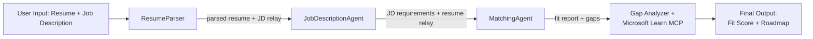

# PersonalCareerCopilot - Resume → Job Fit Evaluator

A workflow-first multi-agent app that evaluates how well a resume matches a job description, then generates a personalized learning roadmap to close the gaps.

---

## Agents

| Agent | Role | Tools |
|-------|------|-------|
| **ResumeParser** | Extracts structured skills, experience, certifications from resume text | - |
| **JobDescriptionAgent** | Extracts required/preferred skills, experience, certifications from a JD | - |
| **MatchingAgent** | Compares profile vs requirements → fit score (0-100) + matched/missing skills | - |
| **GapAnalyzer** | Builds a personalized learning roadmap with Microsoft Learn resources | `search_microsoft_learn_for_plan` (MCP) |

## Workflow



---

## Quick start

### 1. Set up environment

This folder is the reference implementation for the workflow-based Lab 02 scaffold. Its `main.py` uses the existing prompt blocks plus `WorkflowBuilder` to wire the four agents together.

```powershell
cd workshop\lab02-multi-agent\PersonalCareerCopilot
python -m venv .venv
.\.venv\Scripts\Activate.ps1          # Windows PowerShell
# source .venv/bin/activate            # macOS / Linux
pip install -r requirements.txt
```

### 2. Configure credentials

Create a `.env` file in this folder:

```powershell
copy .env .env.bak 2>$null; echo $null > .env
```

Edit `.env`:

```env
FOUNDRY_PROJECT_ENDPOINT=https://<your-account>.services.ai.azure.com/api/projects/<your-project>
AZURE_AI_MODEL_DEPLOYMENT_NAME=gpt-4.1-mini
```

| Value | Where to find it |
|-------|------------------|
| `FOUNDRY_PROJECT_ENDPOINT` | Foundry Toolkit sidebar → right-click your project → **Copy Project Endpoint** |
| `AZURE_AI_MODEL_DEPLOYMENT_NAME` | Foundry sidebar → expand project → **Models + endpoints** → deployment name |

### 3. Run locally

```powershell
python -m debugpy --listen 127.0.0.1:5679 main.py --port 8088
```

Or use the VS Code task: `Ctrl+Shift+P` → **Tasks: Run Task** → **Run Agent HTTP Server**.

For F5 debugging, use **Debug Local Agent HTTP Server**.

### 4. Test with Agent Inspector

Open Agent Inspector: `Ctrl+Shift+P` → **Foundry Toolkit: Open Agent Inspector**.

Paste this test prompt:

```
Resume:
Jane Doe
Senior Software Engineer with 5 years of experience in Python, Django, and AWS.
Built microservices handling 10K+ requests/second. Led a team of 4 developers.
Certifications: AWS Solutions Architect Associate.
Education: B.S. Computer Science, State University.

Job Description:
Senior Cloud Engineer at Contoso Ltd.
Required: Python, Azure, Kubernetes, Terraform, CI/CD pipelines.
Preferred: Go, monitoring (Prometheus/Grafana), cost optimization.
Experience: 5+ years in cloud infrastructure.
Certifications: Azure Solutions Architect Expert preferred.
```

**Expected:** A fit score (0-100), matched/missing skills, and a personalized learning roadmap with Microsoft Learn URLs.

### 5. Deploy to Foundry

`Ctrl+Shift+P` → **Foundry Toolkit: Deploy Hosted Agent** → select your project → confirm.

---

## Project structure

```
PersonalCareerCopilot/
├── .env                ← Your credentials (git-ignored)
├── .env.example        ← Environment template for Groq and Foundry
├── agent.yaml          ← Hosted agent definition (name, resources, env vars)
├── Dockerfile          ← Container image for Foundry deployment
├── groq_main.py        ← Groq 4-agent pipeline runner (ultra-fast, interactive)
├── main.py             ← Foundry 4-agent workflow (instructions, MCP tool, WorkflowBuilder)
└── requirements.txt    ← Python dependencies (groq, agent-framework, mcp)
```

## Key files

### `groq_main.py`
Standalone, ultra-fast 4-agent sequential workflow powered by Groq (`llama-3.3-70b-versatile`) with tool-calling for learning resource recommendations. Run with: `python groq_main.py`.

### `agent.yaml`

Defines the hosted agent for Foundry Agent Service:
- `kind: hosted` - runs as a managed container
- `protocols` - `responses` protocol with `version: 1.0.0`, exposing the `/responses` HTTP endpoint
- `environment_variables` - `AZURE_AI_MODEL_DEPLOYMENT_NAME` is declared here; `FOUNDRY_PROJECT_ENDPOINT` is injected automatically at deploy time

### `main.py`

Contains:
- **Agent instructions** - four `*_INSTRUCTIONS` constants, one per agent
- **MCP tool** - `search_microsoft_learn_for_plan()` calls `https://learn.microsoft.com/api/mcp` via Streamable HTTP
- **Agent creation** - four `Agent()` + `AgentExecutor()` instances sharing one `FoundryChatClient`
- **Workflow graph** - `WorkflowBuilder` wires agents as a sequential pipeline: ResumeParser → JD Agent → MatchingAgent → GapAnalyzer
- **Server startup** - `ResponsesHostServer` runs on port 8088

### `requirements.txt`

| Package | Purpose |
|---------|----------|
| `groq` | Groq Python SDK for fast cloud LLM inference & tool calling |
| `python-dotenv` | Loads `.env` configuration |
| `agent-framework-foundry` | Core runtime: `Agent`, `AgentExecutor`, `WorkflowBuilder`, `@tool`, `FoundryChatClient` |
| `agent-framework-foundry-hosting` | `ResponsesHostServer` + Foundry hosting integration |
| `mcp<2,>=1.24.0` | MCP client for GapAnalyzer (`streamable_http_client`) |
| `debugpy` | Python debugging (F5 in VS Code) |


---

## Troubleshooting

| Issue | Fix |
|-------|-----|
| `KeyError: 'FOUNDRY_PROJECT_ENDPOINT'` or `KeyError: 'AZURE_AI_MODEL_DEPLOYMENT_NAME'` | Create `.env` with both `FOUNDRY_PROJECT_ENDPOINT` and `AZURE_AI_MODEL_DEPLOYMENT_NAME` set |
| `ModuleNotFoundError: No module named 'agent_framework'` | Activate venv and run `pip install -r requirements.txt` |
| No Microsoft Learn URLs in output | Check internet connectivity to `https://learn.microsoft.com/api/mcp` |
| Only 1 gap card (truncated) | Verify `GAP_ANALYZER_INSTRUCTIONS` includes the `CRITICAL:` block |
| Port 8088 in use | Stop other servers: `netstat -ano \| findstr :8088` |

For detailed troubleshooting, see [Module 8 - Troubleshooting](../docs/08-troubleshooting.md).

---

**Full walkthrough:** [Lab 02 Docs](../docs/README.md) · **Back to:** [Lab 02 README](../README.md) · [Workshop Home](../../../README.md)