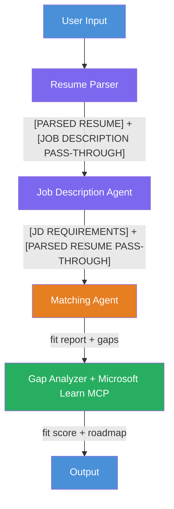

# Lab 02 - Multi-Agent Workflow: Resume → Job Fit Evaluator

## Overview

In this hands-on lab, you'll build a **workflow-first multi-agent app** using Foundry Toolkit in VS Code and deploy it to Microsoft Foundry Agent Service.

**What you'll build:** a Resume → Job Fit Evaluator that parses a resume and job description, scores the match, and produces a personalized learning roadmap using Microsoft Learn resources.

---

## Architecture



**How it works:**
1. The user pastes a resume and job description.
2. **ResumeParser** parses the resume and copies the JD verbatim into a `[JOB DESCRIPTION PASS-THROUGH]` section.
3. **JD Agent** extracts structured requirements from the pass-through, then relays the `[PARSED RESUME]` forward as `[PARSED RESUME PASS-THROUGH]`.
4. **MatchingAgent** compares `[PARSED RESUME PASS-THROUGH]` vs `[JD REQUIREMENTS]` and produces a fit score.
5. **GapAnalyzer** turns the gaps into a practical roadmap and fetches real Microsoft Learn links via MCP.

---

## Prerequisites

Complete Lab 01 first:

- [Lab 01 - Single Agent](../lab01-single-agent/README.md)

---

## Part 1: Read the modules in order

See the full learning path in:

- [Lab 2 Docs - Prerequisites](docs/00-prerequisites.md)
- [Lab 2 Docs - Full Learning Path](docs/README.md)
- [PersonalCareerCopilot run guide](PersonalCareerCopilot/README.md)

---

## Part 2: Build and test the workflow

1. Use the Foundry Toolkit wizard to scaffold the workflow-based project.
2. Copy the prompt blocks and workflow graph from `PersonalCareerCopilot/main.py` into your workspace.
3. Run locally with the Agent Inspector and verify all four agents plus the MCP tool.
4. Deploy the hosted agent to Foundry when local testing passes.

---

## ⚡ Running Multi-Agent with Groq (Fast / Workshop Mode)

To run this complete 4-agent sequential workflow with **Groq** (`llama-3.3-70b-versatile`):

```bash
cd workshop/lab02-multi-agent/PersonalCareerCopilot

# 1. Setup virtual environment
python -m venv .venv
source .venv/bin/activate   # On Windows: .\.venv\Scripts\Activate.ps1

# 2. Configure .env
cp .env.example .env
# Edit .env and set GROQ_API_KEY=gsk_...

# 3. Install requirements
pip install -r requirements.txt

# 4. Run the 4-agent pipeline
python groq_main.py
```

---

## Orchestration patterns

Lab 02 includes the default **fan-out → fan-in → sequential** flow, and the docs also describe alternative orchestration patterns for experimentation.

- **Fan-out/Fan-in with weighted consensus**
- **Reviewer/critic pass before final roadmap**
- **Conditional router** based on fit score and missing skills

See [docs/04-orchestration-patterns.md](docs/04-orchestration-patterns.md).

---

**Previous:** [Lab 01 - Single Agent](../lab01-single-agent/README.md) · **Back to:** [Workshop Home](../../README.md)

